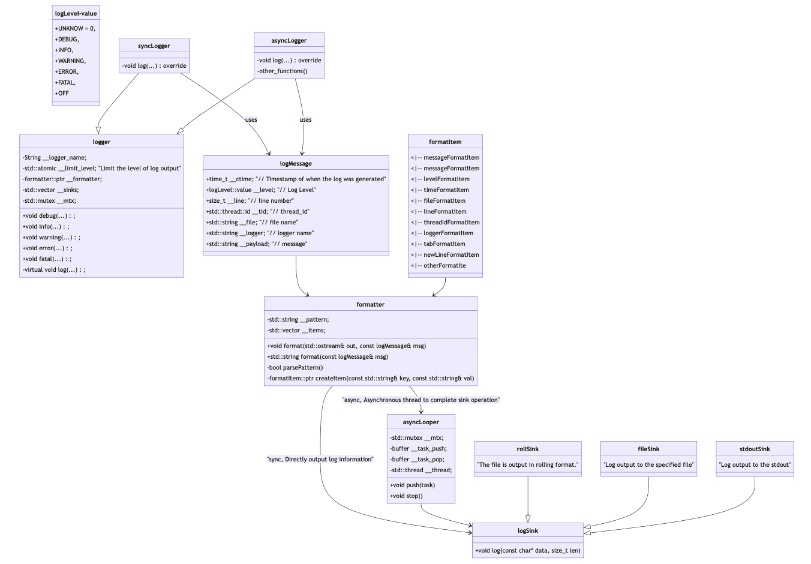

# Multi-Pattern-Logging-System

- [简体中文](./README-cn.md)
- [English](./README.md)

C++ version of synchronous &amp; asynchronous logging system based on multiple design patterns

基于多设计模式的C++版同步&异步日志系统

> [!TIP]
> 如果你对本项目的运行和实现有任何疑问，或者对本项目有更好的优化建议，可以直接联系我，或者在仓库的issue中留言。

## 项目的基本信息

本项目主要是实现一个日志系统，主要支持以下功能:

- 支持多级别日志消息
- 支持同步日志和异步日志
- 支持可靠写入日志到控制台、文件以及滚动文件中
- 支持多线程程序并发写日志
- 支持扩展不同的日志落地目标地

**核心技术栈:** 类层次设计（继承和多态）、C++11（多线程、右值引用等）、双缓冲区、生产者消费者模型、多线程、设计模式（单例、工厂代理、建造者等）、GTest测试框架

> [!WARNING]
> **这个是一个组件型的项目，不是业务型的项目，最后是需要给别人去用的。**

## 如何使用

- [Documentation of the Log System](./docs/documentation.md)

## 性能测试

**测试环境：**
- 虚拟机: Parallels Desktop, Ubuntu22.04 VirtualHost 内存2G CPU双核
- 宿主机: Macbook Air M2 内存16G

如何使用`bench`代码，请见 `bench/bench.cc`。

**测试方式:** 每一种配置测试10次取平均结果，结果如下所示。

| MODE         | Thead Number | Message Size (KB) | Message per second (M/s) | Output Size per second (MB/s) |
| ------------ | ------------ | ----------------- | ------------------------ | ----------------------------- |
| LOGGER_SYNC  | 1            | 976562(100 items) | 1.60668                  | 153.224                       |
| LOGGER_SYNC  | 10           | 976562            | 1.80325                  | 171.971                       |
| LOGGER_ASYNC | 1            | 976562            | 1.30354                  | 124.314                       |
| LOGGER_ASYNC | 10           | 976562            | 3.15184                  | 300.582                       |

> [!TIP]
> 通过测试结果也可以看出，多线程模式下，异步工作模式对性能有很大的提升帮助。

### 技术补充

对于完成这个项目，我用一个文档补充了关于不定参函数和六种设计模式的详细解释，作为这个项目的前置技术补充。

- [Prerequisite knowledge document for the project](./docs/supplement.md)

## 项目的具体实现

项目具体结构如下所示。

细节上的实现见以下文档:

- [word.md](./docs/work.md)

## 一些想法

- 封装成库
- 了解下如何封装成其他语言的接口，比如 Python 和 C#，可以尝试一下。看看是否能在 Python/C# 里面调用库使用这个日志系统。