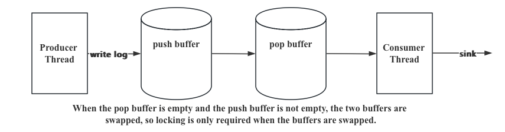

# 项目详细实现

- [项目详细实现](#项目详细实现)
  - [框架设计](#框架设计)
  - [工具类编写](#工具类编写)
  - [日志等级模块](#日志等级模块)
  - [日志消息类](#日志消息类)
  - [消息格式化模块](#消息格式化模块)
  - [日志落地模块设计（工厂模式）](#日志落地模块设计工厂模式)
  - [日志器模块（建造者模式）](#日志器模块建造者模式)
  - [异步日志器模块](#异步日志器模块)
    - [双缓冲区设计思想](#双缓冲区设计思想)
    - [单个缓冲区的设计](#单个缓冲区的设计)

## 框架设计

- 日志登记模块：枚举出日志分为多少个等级，对不同的日志需要有不同的等级标记
- 日志消息模块：封装一条日志所需的各种要素（时间，线程ID，文件名，行号，日志等级，消息主题...）
- 消息格式化模块：按照指定的格式，对日志消息关键要素进行组织，最终得到一个指定格式的字符串
- 日志落地模块：对上面的这几个模块进行整合
  - 同时还需要增加，同步日志器模块和异步日志器模块
- 异步线程模块：负责异步日志的实际落地输出功能
- 单例的日志器管理模块：对日志进行全局的管理，以便能够在项目的任何位置获取指定的日志器进行日志输出

整体框架如下所示。


## 工具类编写

**具体需要以下功能：**
- 获取时间
- 判断文件（目录）是否存在
- 获取文件的父级目录
- 创建指定路径的文件夹

代码如下所示：
```cpp
namespace ffengc_log {
namespace util {
    class Date {
    public:
        static size_t getTime() { return (size_t)time(nullptr); }
    };
    class File {
    public:
        static bool exists(const std::string& path_name) {
            struct stat st;
            if (stat(path_name.c_str(), &st) < 0)
                return false;
            return true;
        }
        static std::string path(const std::string& path_name) {
            // ./abc/a.txt
            auto pos = path_name.find_last_of("/\\");
            if (pos == std::string::npos)
                return ".";
            return path_name.substr(0, pos + 1);
        }
        static void createDirectory(const std::string& path_name) {
            // ./abc/bcd/a.txt
            size_t pos = 0, idx = 0;
            while (idx < path_name.size()) {
                pos = path_name.find_first_of("/\\", idx);
                if (pos == std::string::npos)
                    mkdir(path_name.c_str(), 0777);
                std::string parent_dir = path_name.substr(0, pos - idx + 1);
                // if (parent_dir == "." || parent_dir == "..") {
                //     idx = pos + 1;
                //     continue;
                // }
                if (exists(parent_dir)) {
                    idx = pos + 1;
                    continue;
                }
                mkdir(parent_dir.c_str(), 0777);
                idx = pos + 1;
            }
        }
    };
} // namespace util
} // namespace ffengc_log
```

然后我会使用 `gtest` 框架来对 `util` 进行单元测试。

## 日志等级模块

具体实现和等级设置如下所示。

```cpp
class logLevel {
public:
    enum class value {
        UNKNOW = 0,
        DEBUG,
        INFO,
        WARNING,
        ERROR,
        FATAL,
        OFF
    };
    const char* toString(logLevel::value level) {
        switch (level) {
        case logLevel::value::DEBUG:
            return "DEBUG";
        case logLevel::value::INFO:
            return "INFO";
        case logLevel::value::WARNING:
            return "WARNING";
        case logLevel::value::ERROR:
            return "ERROR";
        case logLevel::value::FATAL:
            return "FATAL";
        case logLevel::value::OFF:
            return "OFF";
        default:
            return "UNKNOW";
        }
        return "UNKNOW";
    }
};
```

## 日志消息类

**需要输出如下要素：**
- 日志的输出时间：用于过滤日志输出时间
- 日志等级：用于进行日志过滤分析
- 源文件名称
- 源文件行号：用于定位出现错误的代码位置
- 线程ID：用于过滤出错的线程
- 日志主体消息
- 日志器名称：当前支持多个日志器同时使用

代码如下所示:

```cpp
namespace ffengc_log {
struct logMessage {
    size_t __ctime; // 日志产生的时间戳
    logLevel::value __level; // 日志等级
    size_t __line; // 行号
    std::thread::id __tid; // 线程id
    std::string __file; // 文件名
    std::string __logger; // 日志器名称
    std::string __payload; // 日志主体
    logMessage(const logLevel::value& level,
        const size_t& line,
        const std::string& file,
        const std::string& logger,
        const std::string& message)
        : __ctime(util::Date::now())
        , __level(level)
        , __line(line)
        , __tid(std::this_thread::get_id())
        , __file(file)
        , __logger(logger)
        , __payload(message) { }
};
} // namespace ffengc_log
```

## 消息格式化模块

现在需要把 `logMessage` 里面的信息，组织成一个字符串。

这里要明确，为了用户可以自己设置到底需要输出多少信息，所以我们要定义指定的输出格式，如下所示。


| 符号 | 描述       |
| ---- | ---------- |
| `%d` | 日期       |
| `%T` | 缩进       |
| `%t` | 线程id     |
| `%p` | 日志级别   |
| `%c` | 日志器名称 |
| `%f` | 文件名     |
| `%l` | 行号       |
| `%m` | 日志消息   |
| `%n` | 换行       |

这样每个 `%...` 可以对应一个信息，这样才能让用户去指定，到底需要输出多少信息，而不是全部统一输出固定的信息。

需要的成员：
- 格式化字符串
- 格式化子项数组：不同的格式化子项，会从日志消息中取出指定的元素，转换为字符串

格式化子项数组 `std::vector<FormatItem::ptr> items` 成员：用于按序保存格式化字符串对应的子格式化对象。`FormatItem` 类主要负责日志消息子项的获取及格式化。


| 类名               | 描述                                 |
| ------------------ | ------------------------------------ |
| `MsgFormatItem`    | 表示要从`LogMsg`中取出有效日志数据   |
| `LevelFormatItem`  | 表示要从`LogMsg`中取出日志等级       |
| `NameFormatItem`   | 表示要从`LogMsg`中取出日志器名称     |
| `ThreadFormatItem` | 表示要从`LogMsg`中取出线程ID         |
| `TimeFormatItem`   | 表示要从`LogMsg`中取出时间戳         |
| `CFileFormatItem`  | 表示要从`LogMsg`中取出源码所在文件名 |
| `CLineFormatItem`  | 表示要从`LogMsg`中取出源码所在行号   |
| `TabFormatItem`    | 表示一个制表符缩进                   |
| `NLineFormatItem`  | 表示一个换行                         |
| `OtherFormatItem`  | 表示非格式化的原始字符串             |

具体实现见代码所示。

## 日志落地模块设计（工厂模式）

其实功能是很好理解的，就是把格式化完成后的日志消息字符串，输出到指定的位置。

> [!TIP]
> 这里可以扩展：支持同时将日志落地到不同的位置

位置分类:
- 标准输出
- 指定文件（事后进行日志分析）
- 滚动文件（文件按照时间/大小进行滚动切换）
  - 日志文件滚动的条件可以选择：大小和时间
  - 日志文件在大于1GB的时候会更换新的文件
  - 每天定点滚动一个日志文件

当然，也支持用户自己编写一个新的落地模块，将日志进行其他方向的落地

实现思想：使用工厂模式进行创建与表示的分离。

具体实现可以见代码。下面放一些代码细节的tips

***

这里如何设计？为了让代码的扩展性更好，所以不应该用 `create()` 参数来控制sink的类型，而是使用模版
```cpp
template<typename SinkType>
class sinkFactory {
public:
    static logSink::ptr create() {
        return std::make_shared<SinkType>();
    }
};
```

但是这里会遇到一个问题，不同sink类的构造是需要不同个数的参数的，这个怎么办？这句话怎么写？`return std::make_shared<SinkType>();`

**所以这里就要用到不定参函数了！**

```cpp
class sinkFactory {
public:
    template <typename SinkType, typename... Args>
    static logSink::ptr create(Args&&... args) {
        return std::make_shared<SinkType>(std::forward<Args>(args)...);
    }
};
```

进行测试:

```cpp
TEST(all_test, sink_basic_test) {
    ffengc_log::logMessage msg(ffengc_log::logLevel::value::INFO,
        53,
        "main.c",
        "root",
        "fmt test...");
    ffengc_log::formatter fmt("abc%%abc[%d{%H:%M:%S}] %m%n");
    std::string str = fmt.format(msg);
    ffengc_log::logSink::ptr stdout_lsp = ffengc_log::sinkFactory::create<ffengc_log::stdoutSink>();
    ffengc_log::logSink::ptr file_lsp = ffengc_log::sinkFactory::create<ffengc_log::fileSink>("./logfile/test.log");
    ffengc_log::logSink::ptr roll_lsp = ffengc_log::sinkFactory::create<ffengc_log::rollSink>("./logfile/roll-", 1024 * 1024);
    stdout_lsp->log(str.c_str(), str.size());
    file_lsp->log(str.c_str(), str.size());
    size_t cur_size = 0;
    size_t cnt = 0;
    while (cur_size < 1024 * 1024 * 10) {
        std::string tmp = str + std::to_string(cnt++);
        roll_lsp->log(tmp.c_str(), tmp.size());
        cur_size += tmp.size();
    }
}

```
对于滚动输出，期望是生成10个日志文件。

## 日志器模块（建造者模式）

日志器模块是对前边多个模块的整合，想要创建一个日志器，需要设置日志器名称，设置日志输出等级，设计日志器类型，设置日志输出格式，且落地方向有可能存在多个，整个日志器的创建过程较为复杂，为了保持良好的代码风格，编写出优雅的代码，因此日志器的创建这里采用了建造者模式。

日志器设计一个抽象的 Logger 基类，然后在基类的基础上，继承出 SyncLogger 和 AsyncLogger。

具体实现如代码所示，思想都是非常简单的。

下面我们测试一下同步日志器。

```cpp
TEST(all_test, sync_logger_test) {
    std::string logger_name = "sync_logger";
    ffengc_log::logLevel::value limit = ffengc_log::logLevel::value::WARNING;
    ffengc_log::formatter::ptr fmt(new ffengc_log::formatter("[%d{%H:%M:%S}][%c][%f:%l][%p]%T%m%n"));
    // 3个日志器
    std::vector<ffengc_log::logSink::ptr> sinks = {
        ffengc_log::sinkFactory::create<ffengc_log::stdoutSink>(),
        ffengc_log::sinkFactory::create<ffengc_log::fileSink>("./logfile/test.log"),
        ffengc_log::sinkFactory::create<ffengc_log::rollSink>("./logfile/roll-", 1024 * 1024)
    };
    ffengc_log::logger::ptr logger(new ffengc_log::syncLogger(logger_name, limit, fmt, sinks));
    size_t cur_size = 0, count = 0;
    std::string str = "log test from sync_logger_test";
    logger->debug(__FILE__, __LINE__, "%s", str.c_str()); // 应该是输出不了的
    logger->info(__FILE__, __LINE__, "%s", str.c_str());
    logger->warning(__FILE__, __LINE__, "%s", str.c_str());
    logger->error(__FILE__, __LINE__, "%s", str.c_str());
    logger->fatal(__FILE__, __LINE__, "%s", str.c_str());

    // while (cur_size < 1024 * 1024 * 10) {
    //     std::string tmp = "[" + std::to_string(count++) + "]" + str;
    //     logger->fatal(__FILE__, __LINE__, "%s", tmp.c_str());
    //     cur_size += tmp.size();
    // }
}
```

理论上来说，输出只能有 `WARNING` 及其以上等级的日志输出。最后测试是成功的。
```sh
[15:44:57][sync_logger][src/test.cc:86][WARNING]  log test from sync_logger_test
[15:44:57][sync_logger][src/test.cc:87][ERROR]  log test from sync_logger_test
[15:44:57][sync_logger][src/test.cc:88][FATAL]  log test from sync_logger_test
```

但此时想要构造一个日志器是非常复杂的，需要传递很多的参数，所以现在需要改造成建造者模式。

建造者代码如代码所示。

测试代码如下所示。

```cpp
TEST(all_test, sync_logger_builder_test) {
    std::unique_ptr<ffengc_log::loggerBuilder> builder(new ffengc_log::localLoggerBuilder());
    builder->buildLoggerLevel(ffengc_log::logLevel::value::WARNING);
    builder->buildLoggerName("sync_logger");
    builder->buildLoggerType(ffengc_log::loggerType::LOGGER_SYNC);
    builder->buildFormatter("[%d{%H:%M:%S}][%c][%f:%l][%p]%T%m%n");
    builder->buildSink<ffengc_log::fileSink>("./logfile/test.log");
    auto logger = builder->build();
    std::string str = "log test from sync_logger_builder_test";
    logger->debug(__FILE__, __LINE__, "%s", str.c_str()); // 应该是输出不了的
    logger->info(__FILE__, __LINE__, "%s", str.c_str());
    logger->warning(__FILE__, __LINE__, "%s", str.c_str());
    logger->error(__FILE__, __LINE__, "%s", str.c_str());
    logger->fatal(__FILE__, __LINE__, "%s", str.c_str());
}
```

## 异步日志器模块

### 双缓冲区设计思想

设计思想：异步处理线程+数据缓冲区。

任务池的设计思想：双缓冲区阻塞数据池

优势：避免了两空间的频繁申请释放，且尽可能的减少生产者与消费者之间锁冲突的概率，提高了任务处理效率。

在任务池的设计中，有很多备选方案，比如循环队列等等，但不管是哪一种都会涉及到锁冲突的情况，因为在生产者与消费者模型中，任何两个角色都具有互斥关系，因此诶一次的任务添加与取出都有可能涉及锁的冲突。而双缓冲区不同，双缓冲区是处理器将一个缓冲区中的任务全部处理完毕后，然后交换两个缓冲区，重新对新的缓冲区中的任务进行处理，虽然同时多线程写入也会冲突，但是冲突并不会像每次只处理一条的时候频繁（减了生产者与消费者之间的锁冲突），且不涉及到空少间的频繁申请释放所带来的消耗。



### 单个缓冲区的设计

1. 这个缓冲区直接存放格式化后的日志消息字符串
2. 当前写入位置的指针（指向可写区域的起始位置，避免数据的写入覆盖）
3. 当前的读取数据位置的指针（指向可读数据区域的起始位置），当读取指针与写入指针指向相同的位置表示数据取完了